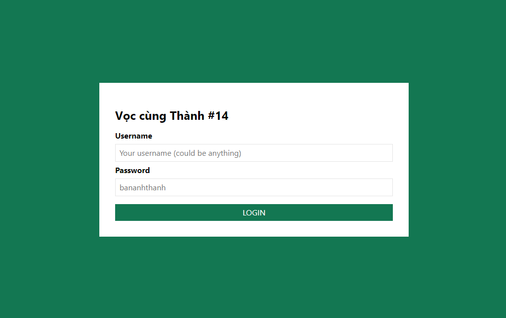

# Vọc cùng Thành #14 - E2E Testing với CyPress

## Giới thiệu



> **[Demo][demo]** | **[DevNow Article][post]**

## Yêu cầu

- [git][git]
- [node][node]

## Cài đặt

```bash
# Clone repository
git clone https://github.com/EGANY-Team/vct-14-cypress
cd vct-14-cypress

# Install package
npm install

# Start dev server at http://localhost:3000
npm start

# Run cypress
npm run cypress

# Build for production
npm run build
```

## Sử dụng

Để chạy được test, bạn cần start dev server trước `npm start`, sau đó dùng lệnh `npm run cypress` để start _CyPress GUI_.

Đến đây thì các bạn có thể lựa chọn bài test để chạy. Chi tiết xem thêm tại trang chủ của _CyPress_ nhé!

## Tài liệu tham khảo

- [create-react-app][cra]
- [cypress][cypress]

[cra]: https://create-react-app.dev
[cypress]: https://cypress.io
[git]: https://git-scm.com
[node]: https://nodejs.org
[post]: https://devnow.vn/?p=3279
[demo]: https://vct-14.thanhnguyen.now.sh
